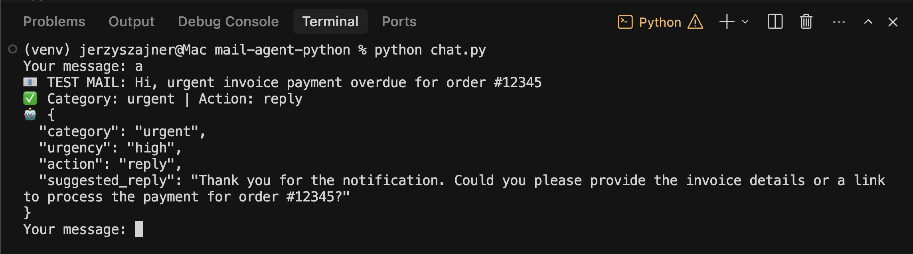

# Email Agent (Gemini CLI)

A simple Python CLI agent for email processing using Gemini 2.5 Flash.  
The project analyzes email content, assigns a category, and suggests a ready-to-send reply.

## Features

- email analysis in chat mode (`chat.send_message`)
- `a` / `analyze` command for a fixed test email with enforced JSON schema output
- Gmail read-only test script (`gmail_test.py`) for fetching inbox subjects
- conversation history (`h`)
- regular chat conversation logging to `mail_log.txt`

## Requirements

- Python 3.10+
- Gemini API key in `.env`

## Installation

```bash
python -m venv venv
source venv/bin/activate
pip install -r requirements.txt
```

Set this value in `.env`:

```env
GEMINI_API_KEY=your_api_key
```

## Run

```bash
python chat.py
```

## Gmail Read-Only Setup

1. Enable Gmail API in Google Cloud.
2. Configure OAuth consent screen in testing mode.
3. Add your test account under OAuth test users.
4. Create OAuth client as **Desktop app** and download `credentials.json`.
5. Place `credentials.json` in the project root.
6. Run:

```bash
python gmail_test.py
```

Expected result:
- browser OAuth flow opens once
- local `token.json` is created
- terminal prints up to 5 message subjects from `INBOX`

## App Commands

- `q` / `quit` / `exit` - exit app
- `h` / `history` - show conversation history
- `a` / `analyze` - run a fixed test email analysis and return JSON

Note: only regular chat messages are appended to `mail_log.txt` in the current version.

## Example Output for `a`

```json
{
  "category": "urgent",
  "urgency": "high",
  "action": "reply",
  "suggested_reply": "Thank you for the reminder. I will look into this immediately."
}
```

## Status

The MVP works locally and is ready for the next step: integration with real inboxes (for example, Gmail API).

## Demo



## Security Notes

- `credentials.json` and `token.json` are local-only secret files.
- They are ignored by git and must never be committed.
